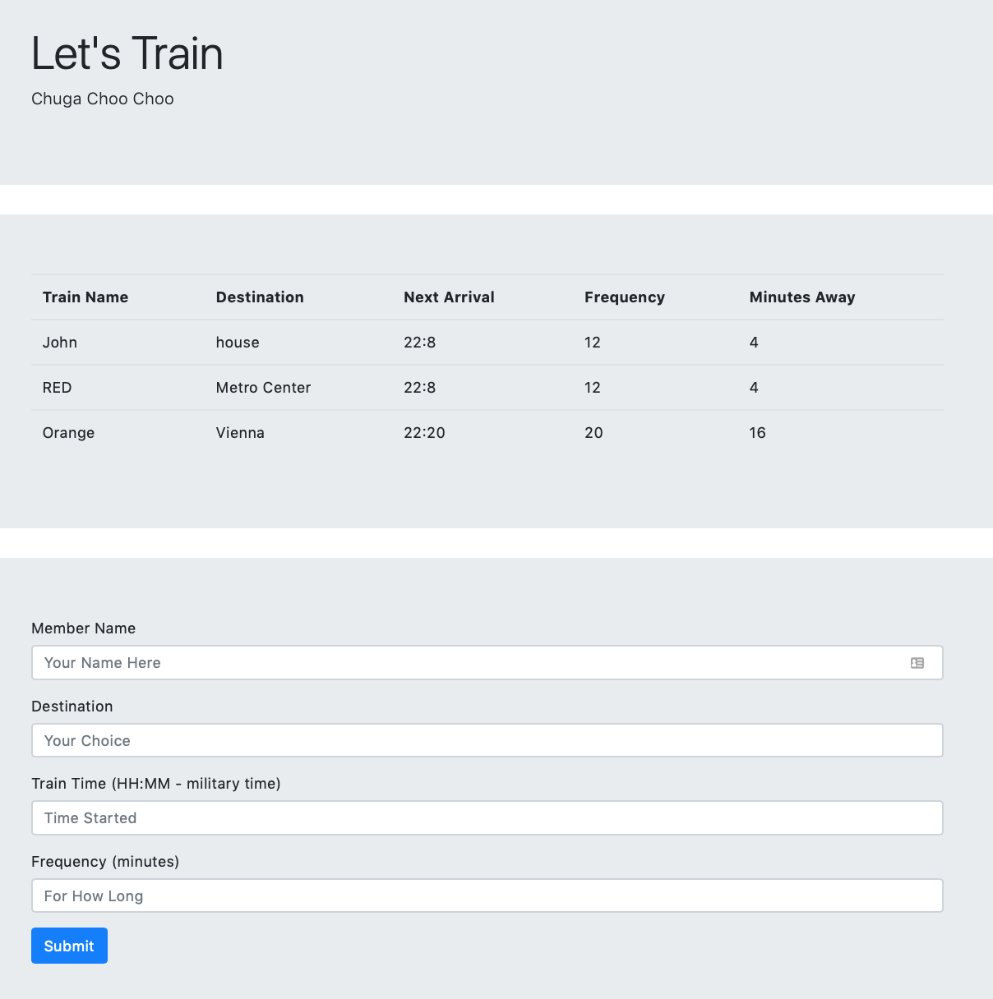

# Train Scheduler

The train scheduler will allow you to enter in the trains you wish to track and provides a notice on how long until the train will arrive.
 
 
To track a new train navigate to the bottom of the page and see the form to create a new train. Start by entering the train name. After that enter the destination the train will be traveling to. The time that the train first arrives entered in 24 hour time. The final field is the frequency in mintues that the train arrives. Once these fields are entered press submit and the form will be submitted to Google Firebase. If the page is refreshed then all the trains will be still be available. 
 
 

 
https://mestipule.github.io/train/train.html
